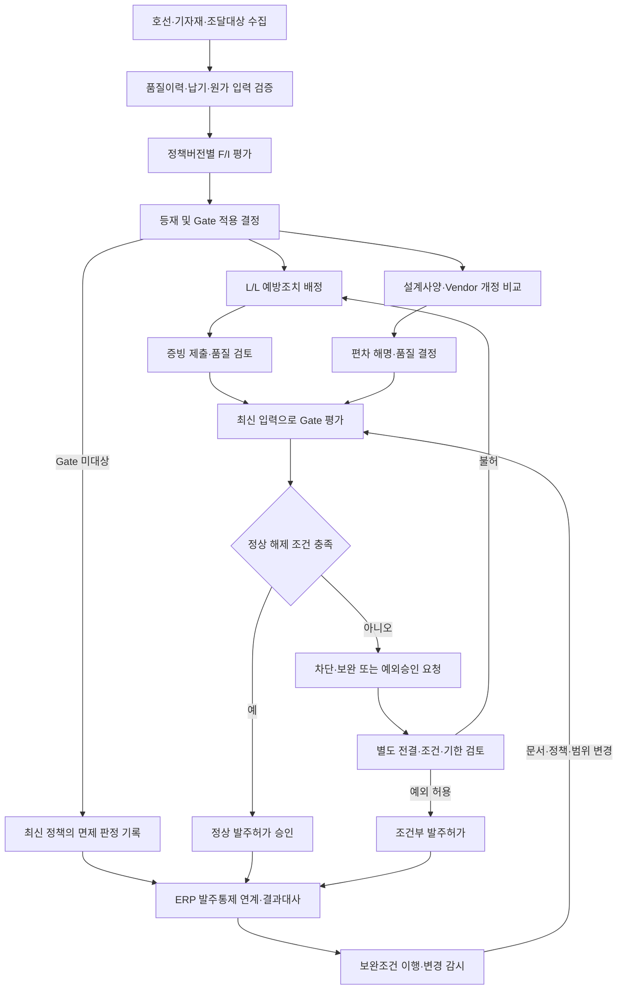

목표 업무 흐름도

```mermaid
flowchart TD
    A[호선·기자재·조달대상 수집] --> B[품질이력·납기·원가 입력 검증]
    B --> C[정책버전별 F/I 평가]
    C --> D[등재 및 Gate 적용 결정]
    D --> E[L/L 예방조치 배정]
    D --> F[설계사양·Vendor 개정 비교]
    D -->|Gate 미대상| X[최신 정책의 면제 판정 기록]
    X --> O
    E --> G[증빙 제출·품질 검토]
    F --> H[편차 해명·품질 결정]
    G --> I[최신 입력으로 Gate 평가]
    H --> I
    I --> J{정상 해제 조건 충족}
    J -->|예| K[정상 발주허가 승인]
    J -->|아니오| L[차단·보완 또는 예외승인 요청]
    L --> M[별도 전결·조건·기한 검토]
    M -->|예외 허용| N[조건부 발주허가]
    M -->|불허| E
    K --> O[ERP 발주통제 연계·결과대사]
    N --> O
    O --> P[보완조건 이행·변경 감시]
    P -->|문서·정책·범위 변경| I
```

