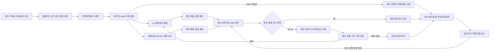
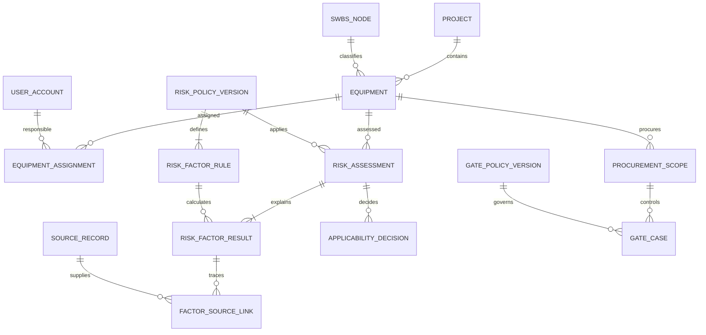
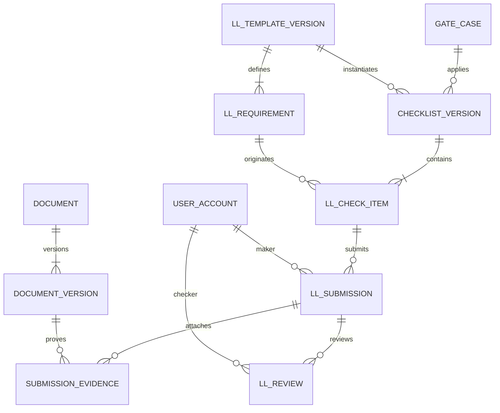
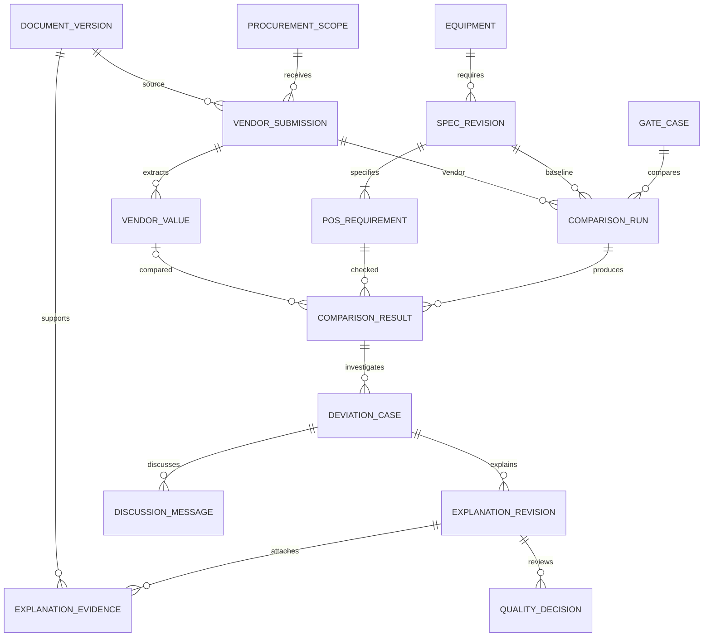
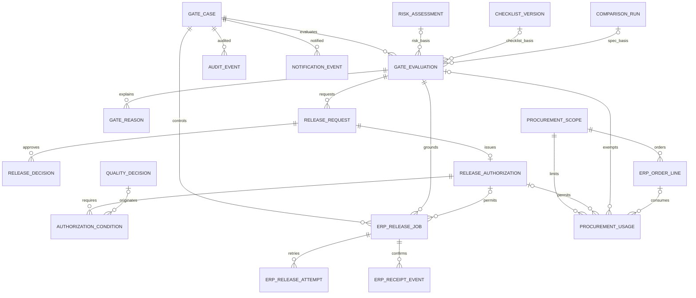
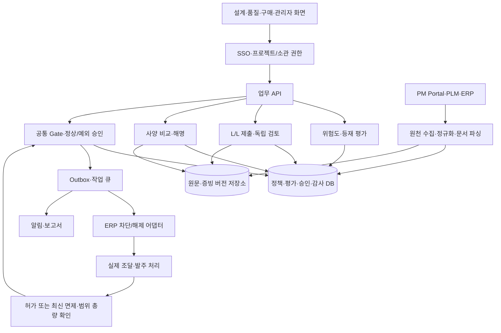
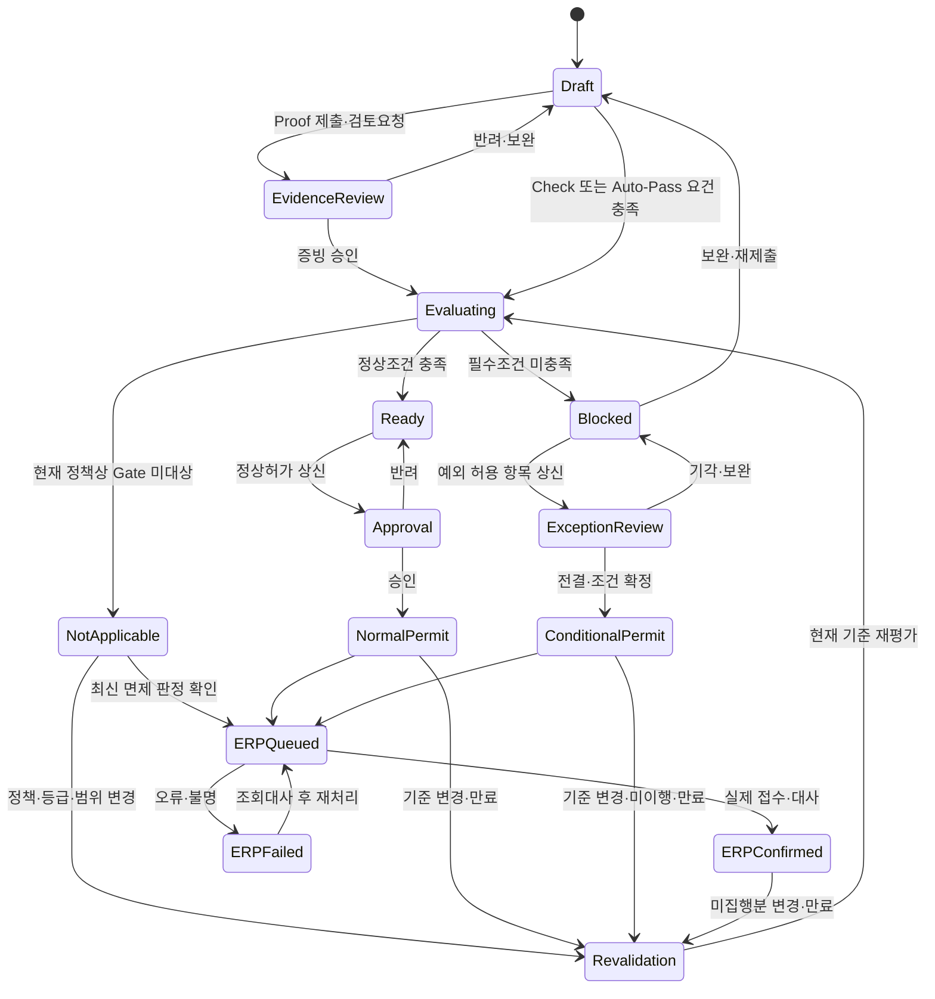
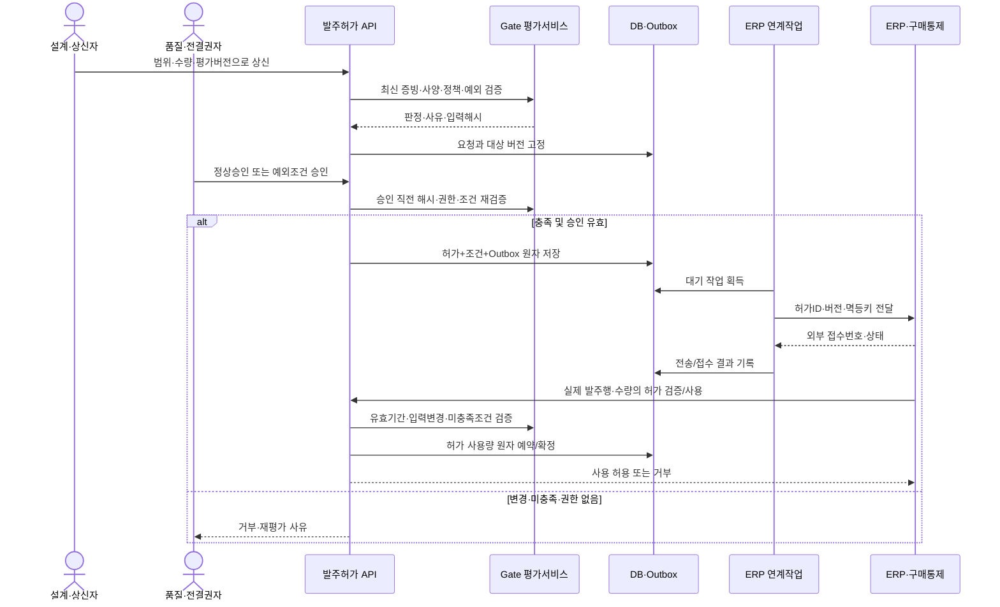

# 선행 품질 예방 관리 시스템 — WBS·ERD·프로그램 설계도

**Pre-QC Gate / 고객 제공 목업 기반 구축 설계 초안**

| 항목 | 내용 |
|---|---|
| 문서명 | `PreQcGate_as_20260915_0921.md` |
| 기준일 | 2026-09-15 |
| 검토 원본 | `F:\Downloads\휴엔\디지털목업_v3\07. 품질_예방 품질 관리 시스템_ver.3.0_260527.html` |
| 요청 저장 위치 | `F:\Downloads\휴엔\디지털목업_v3\PreQcGate_as_20260915_0921.md` |
| 시스템 명칭 | 선행 품질 예방 관리 시스템 — 특수선 주요기자재 선행 품질검증 및 발주 Gate |
| 분석 방법 | 원본 HTML/JavaScript 전체 분석, Edge에서 설계·품질 페르소나 및 주요 업무 동작 확인 |
| 문서 성격 | 실제 목업 동작과 신규 운영 설계를 구분한 구축 계획. 고객 정책·연계 명세 승인 전 |
| 용어 구분 | 본 문서의 WBS는 시스템 구축 작업분해도. SWBS는 기자재의 선체/추진/전력 등 업무 분류 |

사용자가 표기한 `디지털목업\_v3` 경로는 존재하지 않아 실제 원본이 있는 `디지털목업_v3`를 기준으로 하였다. 파일명은 `07.`로 시작한다. 파일명의 ver.3.0과 로그인 하단의 `v14.0 Mock-up`은 서로 다른 표기이며, 본 문서는 특정 제품 버전으로 정규화하지 않는다. 원본 HTML은 수정하지 않는다. 인접한 `08. 품질_협력사 품질 리스크 관리 시스템`은 이번 상세 분석 범위에 포함하지 않는다.

## 1. 목업 분석 및 목표 업무

### 1.1 시스템 목적

과거 품질 문제와 기자재의 원가·납기 영향을 이용해 관리 우선순위를 정하고, 발주 전에 L/L 예방조치와 설계사양 적합성을 확인한다. 설계담당자가 제출한 주요 증빙은 품질담당자가 독립 검토하며, 미충족 사항이 있는 기자재의 발주는 차단한다. 예외가 필요한 경우 근거·책임·보완조건·유효기간을 갖춘 별도 승인을 거치고 ERP 반영 결과까지 추적한다.

핵심 관리 객체는 **호선별 기자재**, **조달/발주 대상 행**, **평가 기준 버전**, **증빙·사양 문서 개정**, **Gate 판정**, **발주 허가 및 ERP 처리 결과**다. 기자재의 `발주 승인=true` 한 값으로 모든 상태를 표현하지 않는다.

### 1.2 확인한 화면과 동작

| 구분 | 목업 확인 내용 | 운영 설계에서 보완할 점 |
|---|---|---|
| 로그인 | 설계/품질 페르소나 2종 선택. 실제 인증 없음 | SSO 사용자 식별, 소관·역할·전결 권한 적용 |
| 대시보드 | 등급 카드, 주요기자재 표시, 4개 지표, SWBS 접기/펼치기, 기자재명/Tag 검색 | 모든 지표를 공통 판정·권한 범위로 집계 |
| 데이터 범위 | 기자재 44개, SWBS 100~700의 7개 계통. 기본 Gate 대상 23개. 설계 페르소나의 목록은 24개 | 실제 프로젝트·담당자 마스터 및 원천 연결 |
| 임박 위험 | 발주예정 60일 이내 및 연체인 주요기자재 중 미해결 건, 날짜순 최대8건 | 전체 위험건수와 표시건수 분리, 담당 범위 필터, 실제 업무 기준일 |
| 상세 1 | L/L 체크리스트: Proof/Check, 설계 실행, 품질 확인, 완료상태 | 실제 증빙 업로드, 문서개정, 승인·반려·재제출 |
| 상세 2 | POS-Vendor 비교: 요구치/단위/설계기준/허용범위/Vendor/편차/PASS·WARN·FAIL | 실제 수치·단위 비교, 원문 위치, 해명과 예외승인 연결 |
| 상세 3 | F/I 점수 근거, 요인별 기여, SWBS별 참조이력 | 고정 총점 역산이 아닌 실제 원천요인→점수 추적 |
| POS 해명 | 설계 의견·파일 선택·협의 댓글, 품질 승인/반려 | 파일명뿐 아니라 실제 파일 보존, 개정별 검토, 변경 시 재승인 |
| 발주 승인 | 품질 역할의 정상 Release/조건부 Override 버튼 | 승인요청·전결·조건·만료·ERP 접수상태 분리 |
| 설정 | F:I 가중치, F/I 내부가중치, 등급 임계값 조정 | 정책 관리자 권한, 검증·승인·적용일·영향분석 |
| 시뮬레이터 | SCAR/PPM/불합격, 일정/비용/품질, 수동보정 입력 | 시험 시나리오와 운영평가 분리, 입력/산식/결과 버전 저장 |
| 알림 트레이 | 설계 증빙 제출, 품질 승인 대기 예시 | 실제 업무 이벤트 기반 알림·읽음·기한·중복방지 |

브라우저 확인에서는 ME-01의 Proof 승인, RG-01의 해명 조건부 승인 및 Override 상태 변경을 재현하였다. 새로고침 시 변경된 승인·해명·Release 상태가 초기값으로 돌아오는 것도 확인하였다. 이러한 실행은 로컬 목업의 메모리 상태 변경이며 실제 PLM·PM Portal·ERP 송신은 아니다.

### 1.3 현재 산식과 업무 규칙

| 항목             | 원본 확인                                                  | 설계 시 취급                                         |
| -------------- | ------------------------------------------------------ | ----------------------------------------------- |
| 종합점수           | `round((F×40%+I×60%)×10)/10`                           | 가중치·반올림 자릿수를 정책 버전으로 관리                         |
| 등급             | 80이상1, 60이상2, 40이상3, 20이상4, 나머지5                       | 경계 포함 여부와 반올림 전/후 판정 순서를 확정                     |
| Gate 적용        | `isMaj(g) = g<=2`                                      | 등재 여부와 별도 관리. 자동대상 예외가 있으면 정책으로 명시              |
| F 시뮬레이터        | SCAR/10·PPM/10000·불합격/20을 각100점 정규화, 30/30/40 가중, 수동보정 | 실제 원천의 관측기간·표본수·중복사건 정의 필요                      |
| I 시뮬레이터        | 일정/비용/품질 입력에 30/30/40 가중, 수동보정                         | 원가/납기 원천과 점수 구간 정의 필요                           |
| F/I 범위         | 보정 후 0~100으로 제한                                        | 입력 유효성 검사와 제한 전/후 값 모두 기록                       |
| 주요 Proof       | 1~2등급 Proof는 설계 제출→품질 승인                               | 제출자와 승인자의 사용자ID 분리                              |
| 일반 Proof·Check | 3~5등급 Proof 및 모든 Check는 설계 실행 시 Auto-Pass              | 실제 문서 또는 확인기록이 있어야 완료. 등급 하락으로 기존 필수승인 자동 소멸 금지 |
| POS            | FAIL이 없으면 통과 가능, WARN은 현재 차단하지 않음                      | WARN 확인·예외 대상·허용오차 정책을 고객 확정                    |

원본의 점수근거 탭은 F 총점을 Punch-A 42%·Punch-B18%·A/S27%·잔여 반복성으로 역산한다. 이는 시뮬레이터의 SCAR/PPM/불합격 산식과 다르다. 또한 `F 또는 I≥35`, `등재 임계값50`, `종합60이상 Gate`라는 서로 다른 설명이 있어 **등재정책과 Gate 적용정책을 각각 확정**해야 한다. SCAR·PPM·GE·DGQR 등의 풀네임과 회사별 의미는 용어사전에서 확정하며 약어만으로 정책을 추정하지 않는다.

### 1.4 목표 업무 흐름도



### 1.5 역할과 업무 책임

| 역할 | 주요 기능 | 제한/책임 |
|---|---|---|
| 설계담당자 | 소관 기자재, Check, Proof 제출, POS 해명·보완, 발주허가 상신 | 자기 제출 Proof 승인 불가, 타 소관 편집 불가 |
| 품질담당자 | 배정된 범위 모니터링, 증빙 검토, POS 해명 판정, 정상 Gate 승인 | 기술적 비교결과 원문 임의 수정 금지, 담당 전결 내 처리 |
| 예외승인권자 | Override 심의·조건/기한/책임자 확정 | 품질 일반검토와 다른 권한으로 설정 가능. 적용 조직은 고객 결정 |
| 구매/조달 담당자 | 조달 대상·발주행 연결, ERP 해제결과·만료 조회 | 화면상 허가만 보고 Gate를 우회하지 않음 |
| 정책관리자 | 점수·등급·등재·Gate·허용오차·라우팅 정책 관리 | 초안 수정과 운영 적용 승인 분리 |
| 운영자/감사자 | 연계 오류·재처리·접근/승인/해제 이력 | 재시도로 승인 사실을 생성하거나 변경하지 않음 |

## 2. WBS — 구축 작업분해도

### 2.1 일정 및 전제

초기 계획은 **착수 후 18주**, PM/업무분석1·설계/서버리드1·화면1·서버2·데이터/연계1·QA1 수준의 협업을 가정한다. 역할 겸임·투입률·실연계 난이도는 미확정이며 확정 견적이나 공수가 아니다. 고객 품질·설계·구매 담당자의 정책 결정과 원천 API/시험자료 제공이 선행 조건이다.

| 단계 | 상대 주차 | 종료 기준 |
|---|---|---|
| 요구·정책 확정 | 1~3 | 등재/Gate·점수·Override·권한·조달단위 합의(G1) |
| 설계·공통 기반 | 3~5 | ERD/API·SSO·문서·감사·연계계약 검토(G2) |
| 위험도·L/L·POS 구현 | 5~11 | 원천 근거·증빙검토·실제 사양비교 및 단위시험 |
| Gate·ERP·관제 통합 | 9~14 | 미충족 발주차단·조건부 승인·실연계 결과대사(G3) |
| 인수·이관·전환 | 14~18 | 대표 기자재 UAT·재검증·복구·운영 인수(G4) |

### 2.2 상세 WBS

PM=업무분석, AR=설계리드, FE=화면, BE=서버, DE=데이터/연계, QA=시험. 주차는 병행 수행 구간이며 행별 기간을 합산하지 않는다.

| WBS | 작업 패키지 | 주차 | 선행 | 주관 | 산출물 / 완료 기준 |
|---|---|---|---|---|---|
| 1.1 | 화면·버튼·상태·예시데이터 추적 | 1~2 | - | PM | 현재 구현/미구현/정책충돌 구분, 화면 목록 |
| 1.2 | 기자재·SWBS·담당·조달단위·원천키 정의 | 1~3 | 1.1 | PM/DE | 호선+Tag·원천행·문서개정 매핑, 중복/다중발주 정책 |
| 1.3 | F/I·등급·등재·Gate·WARN 정책 확정 | 1~3 | 1.1 | PM/품질 | 산식/정답표본, 35/50/60 기준 충돌 해소 |
| 1.4 | Maker-Checker·Override 전결·만료·재차단 확정 | 1~3 | 1.1 | PM/고객 | 권한표·예외 불허조건·승인 후 변경 정책 |
| 2.1 | 논리/물리 ERD·데이터 사전·API 계약 | 3~5 | 1.2~1.4 | AR/DE | PK/FK/UQ, 버전·기간·감사·인덱스 명세 |
| 2.2 | SSO·역할·소관 권한·메뉴 골격 | 3~5 | 1.4 | BE/FE | 목록·알림·직접조회·다운로드 동일 권한 시험 |
| 2.3 | 문서 업로드·개정·보관·열람 기반 | 3~6 | 2.1 | BE | 실제 파일·해시·검사·버전·권한 검증 |
| 2.4 | 실행이력·감사·작업큐·배포 기반 | 3~6 | 2.1 | AR/BE | 환경 분리, 관측·재시도·실패/취소·복구 골격 |
| 3.1 | 기자재·조달·담당·기한 마스터 연계 | 4~7 | 1.2,2.1 | DE | 원천 증분·중복·이동/취소·누락 대사 |
| 3.2 | 품질이력·납기/원가 입력 수집·정규화 | 5~8 | 3.1,1.3 | DE | 관측기간·분모·원천증거·결측관리 |
| 3.3 | 위험도 정책 버전·점수·등재/Gate 평가 | 6~9 | 3.2,2.4 | BE | 총점/요인/등급 동일 산식, 가중치/경계 검증 |
| 3.4 | 점수 근거·시뮬레이터·정책 영향분석 | 7~10 | 3.3 | FE/BE | 시험/운영평가 구분, 정책변경 전후 목록·재검증 대상 |
| 4.1 | PM Portal L/L 수집·룰/템플릿·기자재 배정 | 5~8 | 3.1,1.4 | DE/BE | 원천 L/L ID·템플릿 개정·중복 없는 배정 |
| 4.2 | Check 실행·Proof 제출·문서개정 연결 | 6~9 | 4.1,2.3 | FE/BE | 유형별 필수입력, 실제 증빙, 임시저장·재제출 |
| 4.3 | 품질 검토·승인/반려·Maker-Checker | 7~10 | 4.2,2.2 | BE/FE | 제출자≠승인자, 대상 개정 고정, 승인취소·보완 |
| 4.4 | L/L 완료 집계·변경 영향·알림 이벤트 | 8~11 | 4.3 | BE | 카드/목록/상세·대기함 동일 완료 기준 |
| 5.1 | PLM POS·Vendor 문서개정 수집·필드 추출 | 5~8 | 3.1,2.3 | DE | 원문페이지·조항·단위·추출 신뢰도·수정이력 |
| 5.2 | 사양 매핑·단위변환·허용오차 비교엔진 | 7~10 | 5.1,1.3 | BE/DE | 수치/범위/문자·누락 비교, PASS/WARN/FAIL/UNKNOWN |
| 5.3 | 비교표·원문·편차 상세·원인 조회 | 8~10 | 5.2 | FE | 목록/모달 같은 비교행 ID·개정/값 표시 |
| 5.4 | 해명·첨부·협의·조건부 검토/반려 | 8~11 | 5.3,4.3 | FE/BE | 초안 보존, 판정과 예외 분리, 보완기한/책임 연결 |
| 6.1 | Gate 공통 평가·사유·입력 스냅숏 | 9~12 | 3.3,4.4,5.4 | BE/AR | 중대누락 차단, 평가 버전·조건별 근거, 전 화면 일관 |
| 6.2 | 정상 발주허가 상신·검토·승인 | 10~12 | 6.1,2.2 | BE/FE | 최신 평가 확인, 조달행·수량범위 고정 |
| 6.3 | Override 심의·조건·기한·이행 관리 | 10~13 | 6.1,1.4 | BE/FE | 미허용 예외 거부, 권한/사유/만료 필수, 정상승인과 구분 |
| 6.4 | ERP 차단/해제 어댑터·멱등·상태대사 | 11~14 | 6.2,6.3,2.4 | DE/BE | 직접발주 경로 통제, 응답유실/중복/실패 시 검증 |
| 6.5 | 문서/정책/기한 변경 재평가·허가 취소/재차단 | 12~14 | 6.4 | BE | 오래된 허가 사용 거부, 이미 발주된 건 영향조치 분리 |
| 7.1 | 대시보드·SWBS·검색·드릴다운 통합 | 8~12 | 3.3,4.4,5.3 | FE/BE | 권한/기준시점/분모 일치, 등급 경계·집계 대사 |
| 7.2 | 임박/연체·승인대기·보완기한 알림 | 10~13 | 6.1,7.1 | BE/FE | 실제 이벤트·전체/표시건수 구분·중복방지·읽음 |
| 7.3 | 감사 조회·Gate 증적 보고서·운영 재처리 | 12~14 | 6.4,2.4 | BE/FE | 발주행→승인→평가→증빙/원천 추적, 출력 재현 |
| 8.1 | 기능·경계값·권한·동시성 회귀시험 | 5~14 | 각 기능 | QA/개발 | 핵심 계산·승인·해제 조건의 자동 검증 |
| 8.2 | 실연계·장애복구·성능·보안 시험 | 13~15 | G3 | QA/AR | 대사·응답유실·권한경계·파일/댓글 처리·복구 |
| 8.3 | 이관 리허설·대표 기자재 고객 UAT | 14~16 | 8.2 | QA/고객 | 미완료/반려/예외/문서개정 사례 및 업무 인수 |
| 8.4 | 교육·병행운영·적용 전환·안정화 | 16~18 | 8.3 | PM/운영 | 구매/품질 공동 인수, 롤백·지원·첫 발주대사 |

선행 경로는 `정책/조달단위 → 원천/문서버전 → L/L·사양비교 → 공통 Gate → 발주허가 → ERP 통제 → UAT`다. 화면만 완성되었더라도 ERP 경로가 Gate를 우회하면 인수 완료로 보지 않는다. 외부 API 미제공 시 계약된 시험 응답으로 개발하되 실연계 완료 여부를 별도 표시한다.

## 3. ERD — 논리 데이터 모델

### 3.1 설계 원칙

이 ERD는 목업에서 도출한 **신규 논리 설계안**이다. 기존 DB가 제공되지 않았으므로 물리 테이블을 확인한 결과가 아니다. PK=기본키, FK=외래키, UQ=유일키, `?`=선택값이다. 모든 업무 테이블에는 생성/수정 사용자·시각, `row_version`을 공통으로 적용한다. 승인/평가 이력은 삭제·덮어쓰기 대신 후속 기록으로 관리한다.

- **기자재와 발주 대상을 분리:** 동일 Tag가 여러 조달 회차·Vendor 개정·분할발주를 가질 수 있다. Gate는 해당 조달 범위를 명시해야 한다.
- **평가와 승인과 ERP 결과를 분리:** 점수·적합성 평가가 통과해도 발주 허가 승인 및 실제 ERP 반영이 각각 필요하다.
- **측정 판정과 예외 수용을 분리:** FAIL이 조건부 승인되더라도 원래 FAIL 및 편차는 보존한다.
- **문서 버전 고정:** 승인된 증빙을 새 파일로 대체할 때 과거 승인 효력과 재검토 범위를 명시한다.
- **실제 사용자 기반 분리:** 역할 전환 UI를 사용자 식별로 보지 않는다. 동일 사용자 자기승인 제한을 서버에서 검증한다.
- 키는 UUID 등 내부 불변 ID, 업무 Tag는 `UQ(project_id,tag_no)`로 관리한다. 값·단위·비교연산자·공차·반올림은 별도 필드다.
- 점수 `decimal(7,3)`, 가중치 `decimal(8,5)`, 측정값/공차 `decimal(24,8)`을 초기안으로 한다. 통화금액은 원 단위 환산을 강제하지 않고 금액·통화·환산기준을 보존한다.

### 3.2 기준정보·위험도 ERD



| 엔터티 | 주요 필드·제약 | 목적 |
|---|---|---|
| PROJECT | id PK, project_code UQ, name, vessel_no, organization, status | 호선/프로젝트 문맥 |
| SWBS_NODE | id PK, scheme_version, code, name, parent_id FK?; UQ(scheme_version,code) | SWBS100~700 분류와 버전 |
| USER_ACCOUNT / ROLE_ASSIGNMENT | id PK, sso_subject UQ, active / id PK, user_id FK, project_id FK, role, valid_from/to | 사용자·역할 유효기간. 필요시 전결 금액/범위 추가 |
| EQUIPMENT | id PK, project_id FK, swbs_node_id FK, tag_no, name, equipment_type, configuration_ref, status; UQ(project,tag_no) | 목업 EQ의 영속 마스터 |
| EQUIPMENT_ASSIGNMENT | id PK, equipment_id FK, user_id FK, responsibility_type, valid_from/to | 설계 소관·품질 검토배정. 같은 기간 역할 중복 규칙 |
| PROCUREMENT_SCOPE | id PK, equipment_id FK, source_record_id FK, procurement_key, scope_revision, vendor_code?, quantity, unit, planned_order_date, status | 조달 요청행/회차. UQ(source system,procurement_key,scope_revision)의 원천 정합성 |
| SOURCE_RECORD | id PK, source_system, entity_type, source_key, revision, received_at, payload_uri, checksum; UQ(system,entity,key,revision) | PM Portal/PLM/ERP 원천 보존과 수신시각 |
| RISK_POLICY_VERSION | id PK, policy_code, version_no, status, valid_from/to, f_weight, i_weight, thresholds, rounding_rule, approved_by FK?, approved_at? | 합100%·임계값 내림차순·동일 기간 적용정책 유일 |
| RISK_FACTOR_RULE | id PK, policy_version_id FK, factor_code, axis, normalization_method, cap, weight, missing_policy | 원천요인·분모·관측기간·정규화·상한 정의 |
| RISK_ASSESSMENT | id PK, equipment_id FK, policy_version_id FK, as_of_at, input_hash, run_kind, f_score, i_score, total_score, grade, status | 공식평가/시뮬레이션 분리, 입력·산식 재현 |
| RISK_FACTOR_RESULT | id PK, assessment_id FK, factor_rule_id FK, raw_value, denominator?, unit, normalized_value, manual_adjustment, adjustment_reason?, contribution | 총점에서 요인 역산 금지. 보정 작성/승인자 기록 |
| FACTOR_SOURCE_LINK | factor_result_id FK, source_record_id FK, source_field, weight?; 복합 PK | 평가요인↔원천이력 N:M |
| APPLICABILITY_DECISION | id PK, assessment_id FK, gate_policy_version_id FK, enrolled, gate_required, reason_codes, decided_at | 등재와 Gate 적용 각각의 결정·근거 |
| GATE_POLICY_VERSION | id PK, policy_code, version_no, status, effective_from/to, applicability_rule, proof_route_rule, warn_rule, override_rule, renewal_rule | Grade→대상/라우팅·WARN·재평가·예외 불허 정책 |
| GATE_CASE | id PK, procurement_scope_id FK, case_revision, gate_policy_version_id FK, applicability_decision_id FK?, state, latest_evaluation_id FK? | 조달범위별 검증 묶음. UQ(scope,case_revision), 현재 유효 사례 유일. 적용 미결정은 차단 상태로 관리 |

각 도메인의 프로젝트는 상위 기자재/조달범위로 결정한다. 교차 프로젝트 FK 연결을 허용하지 않고, 알림·원문 다운로드에도 같은 소관 권한을 적용한다. `latest_evaluation_id`는 편의 포인터이며 이력의 원본은 GATE_EVALUATION이다.

### 3.3 L/L·증빙·검토 ERD



| 엔터티 | 주요 필드·제약 | 목적 |
|---|---|---|
| LL_TEMPLATE_VERSION | id PK, template_code, version_no, source_record_id FK?, applicability_rule, status; UQ(code,version) | PM Portal L/L 및 표준 예방조치 템플릿 |
| LL_REQUIREMENT | id PK, template_version_id FK, source_ll_key, item_code, category, item_type(PROOF/CHECK), requirement_text, mandatory, evidence_rule | 반복 문구 대신 원천 L/L ID·고유 항목 |
| CHECKLIST_VERSION | id PK, gate_case_id FK, template_version_id FK, version_no, status, effective_at | Gate별 승인 대상 점검목록 고정 |
| LL_CHECK_ITEM | id PK, checklist_version_id FK, requirement_id FK, item_no, route_snapshot, applicable, exclusion_reason?; UQ(checklist,item_no) | 당시 Proof/Check와 Maker-Checker 라우팅 보존 |
| LL_SUBMISSION | id PK, check_item_id FK, revision_no, maker_id FK, declaration?, submitted_at?, status, previous_submission_id FK? | Check 실행 또는 Proof 제출. 승인 후 수정은 새 개정 |
| DOCUMENT / DOCUMENT_VERSION | id PK, document_no, document_type, security_class / id PK, document_id FK, revision_no, storage_uri, hash, file_name, mime, size, uploaded_by FK, uploaded_at, scan_status; UQ(document,revision) | 실제 파일·문서개정·검사상태. 파일명만 저장하지 않음 |
| SUBMISSION_EVIDENCE | submission_id FK, document_version_id FK, evidence_type, page_ref?; 복합 PK | 제출↔여러 증빙 N:M, 승인 대상 문서 버전 고정 |
| LL_REVIEW | id PK, submission_id FK, reviewer_id FK, decision, reason, reviewed_at, reviewed_hash, supersedes_review_id FK? | 승인/반려/취소 이력. 주요 Proof의 maker와 reviewer 불일치 강제 |

Check도 사용자·시각·확인내용을 기록한다. 일반 Proof가 Auto-Pass 대상이더라도 실제 필수 파일의 존재·검사·요건 충족은 확인한다. 파일 업로드 이벤트만으로 주요 Proof의 품질 승인을 생성하지 않는다.

### 3.4 POS·Vendor 비교·해명 ERD



| 엔터티 | 주요 필드·제약 | 목적 |
|---|---|---|
| SPEC_REVISION | id PK, equipment_id FK, document_version_id FK, revision_no, effective_at, status | PLM POS 기준 개정, 임의 최신자료 치환 금지 |
| POS_REQUIREMENT | id PK, spec_revision_id FK, requirement_code, clause_no, page_no, characteristic, value_type, operator, lower/upper_value?, include_lower/upper, nominal_value?, unit, tolerance_type, tolerance_value?, mandatory | 부등호·허용오차·정성 사양을 문자열 한 칸으로 저장하지 않음 |
| VENDOR_SUBMISSION | id PK, procurement_scope_id FK, document_version_id FK, revision_no, received_at, parse_status, reviewed_by FK? | 협력사 문서와 조달범위·제출개정 연결 |
| VENDOR_VALUE | id PK, vendor_submission_id FK, requirement_code?, extracted_text, parsed_value?, unit, page_no, source_region, confidence?, verification_status | OCR/파싱값과 담당자 확정값·원문위치 구분 |
| COMPARISON_RULE_VERSION | id PK, version_no, unit_conversion_set, numeric_rule, tolerance_rule, qualitative_rule, missing_rule, status | 단위변환·엄격부등호·WARN/FAIL 경계 정책 |
| COMPARISON_RUN | id PK, gate_case_id FK, spec_revision_id FK, vendor_submission_id FK, rule_version_id FK, input_hash, status, executed_at | 입력개정·룰·비교실행 불변 |
| COMPARISON_RESULT | id PK, run_id FK, requirement_id FK, vendor_value_id FK?, normalized_vendor_value?, normalized_unit, deviation?, technical_verdict, reason_code, source_ref | PASS/WARN/FAIL/UNKNOWN. 미확정·누락은 PASS로 처리 금지 |
| DEVIATION_CASE | id PK, comparison_result_id FK, case_no, owner_id FK, status; UQ(result,case_no) | 해명·예외 심의의 영속 식별자. 배열 인덱스 사용 금지 |
| EXPLANATION_REVISION | id PK, deviation_case_id FK, revision_no, author_id FK, text, submitted_at?, status; UQ(case,revision) | 반려·재제출·승인본 잠금, 초안 임시저장 |
| EXPLANATION_EVIDENCE | explanation_revision_id FK, document_version_id FK, relation_type; 복합 PK | 해명 첨부 원본/버전 |
| QUALITY_DECISION | id PK, explanation_revision_id FK, reviewer_id FK, decision, reason, conditions_text?, expires_at?, decided_at, input_hash | ACCEPT_EXCEPTION/REJECT/REQUEST_MORE 등. 기술적 FAIL을 삭제하지 않음 |
| DISCUSSION_MESSAGE | id PK, deviation_case_id FK, author_id FK, message_text, created_at, related_explanation_id FK? | 협의 댓글. 텍스트 이스케이프·수정이력 적용 |

사양 개정 후 재비교는 새로운 COMPARISON_RUN을 만든다. 과거 해명 승인을 새 요구치·Vendor 개정에 자동 승계하지 않는다. 동일 기자재의 다른 조달 Vendor에 예외 승인이 전파되지 않게 범위를 제한한다.

### 3.5 Gate·발주허가·ERP·감사 ERD



| 엔터티 | 주요 필드·제약 | 목적 |
|---|---|---|
| GATE_EVALUATION | id PK, gate_case_id FK, risk_assessment_id FK?, checklist_version_id FK?, comparison_run_id FK?, gate_policy_version_id FK, dependency_hash, input_manifest_uri, evaluated_at, valid_until?, evaluation_state | 미적용·입력누락 차단도 기록하므로 일부 입력 FK는 선택값. READY/허가심의에는 정책상 필수 입력이 모두 있어야 함. 실제 증빙/리뷰 ID는 GATE_REASON과 불변 평가 manifest에 보존 |
| GATE_REASON | id PK, evaluation_id FK, reason_code, severity, ll_submission_id FK?, comparison_result_id FK?, quality_decision_id FK?, description, blocks_normal_release, exception_allowed | 어떤 조건이 충족/미충족인지 상세 근거. 이유 유형에 맞는 FK 필수 검증 |
| RELEASE_REQUEST | id PK, evaluation_id FK, requester_id FK, request_type(NORMAL/OVERRIDE), scope_quantity, unit, reason?, status, submitted_at | 승인 대상 조달범위·수량·평가버전 고정 |
| RELEASE_DECISION | id PK, request_id FK, step_no, approver_id FK, decision, reason, decided_at, approved_hash | 전결 단계별 승인/반려. 자기승인·권한·대리 유효기간 검증 |
| RELEASE_AUTHORIZATION | id PK, request_id FK UQ, authorization_no UQ, authorization_type, state, valid_from/to, authorized_qty, consumed_qty, issue_hash, revoked_reason? | 정상허가/조건부허가·만료/취소 구분. 승인 요청 1건에 최대1개 허가 |
| AUTHORIZATION_CONDITION | id PK, authorization_id FK, quality_decision_id FK?, condition_text, owner_id FK, due_at, condition_kind(PRE_ORDER/POST_ORDER), status, completion_doc_version_id FK?, verified_by FK? | 발주 전 필수조건과 발주 후 이행조건 분리. 미이행/연체 처리 |
| ERP_RELEASE_JOB | id PK, gate_case_id FK, evaluation_id FK, authorization_id FK?, operation(RELEASE/HOLD/REVOKE), control_version, target_system, idempotency_key UQ, payload_hash, status, external_ref?, created_at | 사례로 조달범위 식별. RELEASE는 유효 허가 또는 최신 면제 판정 필수. 최초 HOLD는 허가 없이 가능. REVOKE는 취소 대상 허가가 있으면 연결. outbox |
| ERP_RELEASE_ATTEMPT / ERP_RECEIPT_EVENT | id PK, job_id FK, attempt_no, sent_at, response_code, result_uri / id PK, job_id FK, external_event_id UQ(시스템 내), status, received_at, payload_hash | 통신시도와 실제 ERP 접수 이벤트 구분 |
| ERP_ORDER_LINE | id PK, procurement_scope_id FK, source_record_id FK, erp_order_no, line_no, revision_no, quantity, unit, status | UQ(ERP system,order,line,revision)로 실제 발주행 연결 |
| PROCUREMENT_USAGE | id PK, procurement_scope_id FK, authorization_id FK?, exemption_evaluation_id FK?, order_line_id FK?, quantity, operation_key UQ, status, reserved_at, consumed_at? | 허가/면제 판정 참조는 정확히 하나. ERP 발주행 생성 전 예약 허용. 조달범위 전체 예약·집행량과 허가별 한도를 함께 통제 |
| INTEGRATION_JOB / SOURCE_MAPPING | id PK, system, entity, cursor, status, started/ended_at, received/failed_count / id PK, source_system, source_key, equipment_id FK?, scope_id FK?, version | 공통 수집/매핑, 동기화 실패와 실제 시각 |
| AUDIT_EVENT | id PK, gate_case_id FK?, actor_id FK?, event_type, target_type, target_id, before/after_hash, event_at, correlation_id | 평가·정책·증빙·승인·해제 추적. 다형 target 참조는 서비스 무결성 검사와 물리설계 시 공통 객체키 채택 여부 확정 |
| NOTIFICATION_RULE / EVENT | id PK, rule_code, condition, channel, offset_days, recipient_role / id PK, rule_id FK, gate_case_id FK, recipient_id FK, source_event_key, status, sent_at?, read_at? | 알림 중복 UQ(rule,source_event,recipient), 전체건수/읽음 분리 |

신규 Gate 사례에는 평가가 아직 없을 수 있다. 자료가 없는 차단 평가에서는 누락 입력 FK를 NULL로 두고 GATE_REASON에 사유를 기록하며 정상허가를 발급하지 않는다. 미적용 사례는 비교/체크리스트 FK를 NULL로 둘 수 있지만, 적용 판단에 사용한 정책·평가·사유를 남긴다. 점수 누락을 자동으로 미적용 처리하지 않는다. READY 판정 또는 허가 심의에 필요한 입력은 Gate 정책별 필수검증으로 강제한다.

### 3.6 무결성 및 버전 규칙

1. 승인 대상은 문서명 대신 문서 버전 ID와 해시다. 증빙 교체·삭제·악성파일 판정 변경 시 의존하는 미집행 허가를 무효화한다.
2. 평가의 `dependency_hash`는 위험평가·정책·조달범위·점검목록·증빙제출/검토·POS 기준/제출/비교·예외결정의 버전을 포함한다. 승인 및 ERP 사용 직전 현재 해시와 비교한다.
3. 주요 Proof 완료는 **필수 증빙 유효 + 제출완료 + 해당 개정 품질승인**이다. Auto-Pass는 승인행 위조 생성이 아니라 `route=AUTO_PASS`의 실행기록으로 보존한다.
4. 허용오차는 정격 허용범위와 다르므로 tolerance_type·적용방향·경계 포함을 명시한다. 서로 다른 단위는 검증된 변환표를 사용하고 변환 불가면 UNKNOWN이다.
5. 일반/주요기자재 전환으로 진행 중 승인 라우팅이 자동 완화되지 않는다. 새 정책의 적용일·영향범위·전환승인 후 새 Gate 사례/평가 버전을 만든다.
6. Gate 승인 후 문서/수량/Vendor/요구치/품질상태가 바뀌면 **미집행분 허가 사용 차단 → 재평가 → 필요 시 ERP HOLD/REVOKE** 순으로 처리한다. 이미 확정된 발주를 소급 삭제하지 않고 구매·품질 영향조치 대상으로 올린다.
7. ERP 접수 실패·응답 불명은 성공으로 간주하지 않는다. 동일 멱등키로 조회대사 후 재시도한다. 실제 발주는 서버가 확인한 유효 허가 또는 최신 NOT_APPLICABLE 평가와 ERP 통제를 충족해야 한다. 면제에 불필요한 품질 결재를 요구하지 않되, 정책·등급 변경으로 대상이 되면 미집행분을 즉시 차단한다.
8. 분할발주는 조달범위 행을 잠그고 모든 요청의 활성 예약량+집행량을 합산하여 조달범위 수량 이내인지 확인한다. 허가 사용이면 해당 허가의 잔여량도 동시에 확인한다. 서로 다른 허가라도 범위 총량을 초과할 수 없다. 허가 교체 시 이전 허가의 미사용분을 취소하며 이미 집행한 양은 범위 누계에 남긴다. 실패 예약은 ERP 미집행을 대사한 뒤 해제한다.
9. 최초 BLOCKED 판정에도 허가 없이 HOLD 작업을 생성할 수 있다. 조달범위별 control_version을 단조 증가시키며 ERP는 마지막 적용 버전보다 오래된 명령을 거부한다. 따라서 HOLD 이후 지연 도착한 RELEASE로 차단이 풀리지 않는다. ERP가 이를 지원하지 않으면 매 발주 시 동기 검증하는 통제 계약을 필수로 확정한다.

## 4. 프로그램 설계도

### 4.1 구성도

기술스택은 제공되지 않았으므로 특정 제품을 확정하지 않는다. 초기안은 웹 화면, 모듈별 업무 API, 관계형 DB, 문서 저장소, 비동기 수집·파싱·알림·ERP 작업 처리기로 구성한다. 핵심 승인과 Gate는 하나의 트랜잭션 경계에서 처리하기 쉬운 모듈 구조로 시작한다.



OCR/AI가 Vendor 자료의 수치·조항을 추출하는 경우 결과는 검토 대상 데이터다. 승인된 구조화 값과 결정 규칙이 Gate를 계산하며, 생성형 모델이 단독으로 기술 적합성이나 발주 허가를 확정하지 않는다. 원본 목업에는 실제 AI 호출이 없다.

### 4.2 화면 설계 목록

| 화면 ID | 화면 / 사용자 | 입력·표시 / 주요 동작 |
|---|---|---|
| QC-UI-01 | 통합 대시보드 / 설계·품질·구매 | 프로젝트·기준시점·등급·소관 필터, SWBS 목록, 완료·위험·허가·ERP 상태, 전체 위험건수와 상위 목록 |
| QC-UI-02 | 기자재/조달 범위 상세 / 담당자 | Tag·Vendor·수량·발주예정·기준개정, Gate 단계, 정상상신/예외상신. 3개 상세 탭 유지 |
| QC-UI-03 | L/L 체크리스트·증빙 / 설계 | 원천 L/L, Proof/Check, 실제 파일, 임시저장·상신·반려사유·재제출 |
| QC-UI-04 | 품질 검토함 / 품질 | 검토요청 목록, 제출자·원문 버전, 승인/반려/보완·취소, 자기승인 차단 |
| QC-UI-05 | POS-Vendor 비교 / 설계·품질 | 요구치·단위·공차·Vendor 원문/확정값·편차·원판정·예외처분·입력개정 |
| QC-UI-06 | 편차 해명·협의 / 설계·품질 | 같은 비교행의 조항·기준·Vendor·편차 표시, 초안·첨부·댓글·제출/검토·보완조건 |
| QC-UI-07 | 위험도 산정근거 / 담당자 | F/I·종합·등급, 원천 값/기간/정규화/기여도, 등재사유와 Gate 적용사유 별도 |
| QC-UI-08 | 정책·임계값 관리 / 정책관리자 | 가중치합·경계 검증, 초안/시뮬레이션·전후 영향·승인/시행/복원 |
| QC-UI-09 | 점수 시뮬레이터 / 허용 사용자 | 입력요인·보정사유·정책버전, 결과·요인기여·경계 분석. 운영점수 자동 덮어쓰기 금지 |
| QC-UI-10 | 발주허가·Override 심의 / 승인자 | 평가 근거, 미충족 목록, 예외허용 여부, 범위·수량·조건·책임·기한, 전결·발급/취소 |
| QC-UI-11 | ERP 연계·발주 대사 / 구매·운영 | 내부 허가와 ERP 접수/실제 발주행 구분, 실패/불명·재시도·허가 사용량 |
| QC-UI-12 | 알림·보완조건·감사 / 담당자·감사 | 기한·미처리·읽음, 조건이행 증빙, 평가→승인→발주 추적과 증적 출력 |

목록·상세·알림에는 `Gate 미적용`, `차단`, `검토중`, `정상허가`, `조건부허가`, `ERP 반영대기/실패/완료`, `만료/재검증 필요`를 구별해 표시한다. 조건부허가를 일반 정상완료 색상/문구로 치환하지 않는다.

### 4.3 서비스·배치·출력 프로그램 목록

| 프로그램 ID | 책임 | 주요 입출력 / 핵심 검증 | 연결 WBS |
|---|---|---|---|
| QC-SV-01 | 사용자·소관·기자재/조달 조회 | SSO/프로젝트/Tag→허용 데이터. 직접 ID 접근·알림·파일 동일 권한 | 2.2,3.1 |
| QC-JB-01 | 마스터·이력·기한 증분 수집 | 원천키/커서→SOURCE_RECORD/매핑. 중복·지연·취소 대사 | 3.1,3.2 |
| QC-SV-02 | 정책 초안·승인·적용 | 요인/가중치/임계값→정책버전. 합100·정렬·유효기간·영향 확인 | 3.3,3.4 |
| QC-SV-03 | 위험도 평가·시뮬레이션 | 원천스냅숏+정책→요인/F/I/종합/등재/Gate. 결측·보정 추적 | 3.3,3.4 |
| QC-SV-04 | L/L 템플릿 배정·Check/Proof 제출 | Gate+L/L버전+파일→체크리스트/제출. 유형별 필수정보 | 4.1,4.2 |
| QC-SV-05 | 증빙 품질 검토 | 제출개정·검토의견→승인/반려/취소. Maker-Checker·파일검사 | 4.3 |
| QC-SV-06 | 파일 업로드·버전·열람 | 파일+메타정보→불변 문서버전/권한 링크. 초안보존·검사·해시 | 2.3 |
| QC-JB-02 | 사양 추출·원문 매핑 | PLM/Vendor문서→요구사항/제출값. 신뢰도·원문위치·수정 추적 | 5.1 |
| QC-SV-07 | 사양 비교 | 기준개정+Vendor개정+룰→PASS/WARN/FAIL/UNKNOWN. 단위·공차·필수누락 | 5.2,5.3 |
| QC-SV-08 | 편차 해명·협의·품질결정 | 비교행ID+해명개정→검토결정/조건. 기술판정 불변 | 5.4 |
| QC-SV-09 | 공통 Gate 판정 | 정책·평가·증빙·비교·예외→Gate 상태/사유/해시. 모든 집계가 사용 | 6.1,7.1 |
| QC-SV-10 | 정상허가 상신·승인 | 최신 Gate+조달범위→승인·허가. 중복·자기승인·버전충돌 | 6.2 |
| QC-SV-11 | Override·조건·이행·취소 | 미충족근거+전결+조건→조건부허가. 예외불허·미이행·만료 | 6.3,6.5 |
| QC-JB-03 | ERP 해제/HOLD/취소 및 대사 | 승인 outbox→ERP접수 이벤트. 멱등키·UNKNOWN 조회·보상 | 6.4 |
| QC-SV-12 | 발주 적격성 검증·사용 | 조달범위+허가 또는 면제평가+수량→허용/거부/예약. 서버 최신판정·범위 총량·허가별 동시사용 한도 | 6.4,6.5 |
| QC-JB-04 | 변경·만료 재검증 | 문서/정책/조달 변경 이벤트→허가 무효화·Gate 재평가·ERP 조치 | 6.5 |
| QC-SV-13 / QC-JB-05 | 관제 집계·임박/기한 알림 | 공통 판정+소관+기준일→집계/알림. 전체/노출건수·중복방지 | 7.1,7.2 |
| QC-RP-01 | Gate 증적 보고서 | 평가·승인·ERP이력→버전 고정 PDF/Excel. 화면과 같은 근거 | 7.3 |
| QC-SV-14 | 감사·연계 운영 | 상관ID/기간/실행→추적/재처리. 운영자가 승인권한 대체 불가 | 2.4,7.3 |

QC-RP-01의 PDF/Excel은 운영 감사용 추가 제안이다. 원본에 실제 보고서 출력 기능이 구현되어 있다는 뜻은 아니다.

### 4.4 Gate 판정 결정표

다음은 정책 합의를 위한 기본안이다. 고객 승인 전 운영 규칙으로 확정하지 않는다. 원본의 목록/상세가 서로 다른 판정을 하므로 하나의 결정표를 채택해야 한다.

| 조건 | Gate 판정 | 정상허가 | 예외 경로 |
|---|---|---|---|
| 승인 정책상 Gate 미대상 | NOT_APPLICABLE | 품질 Gate 면제 확인. 구매 기본통제는 유지 | 면제 결정 근거 기록 |
| 주요 Proof 미제출/미검토, 필수자료 누락, 비교 UNKNOWN | BLOCKED | 불가 | 법정/계약 필수 등 예외불허 항목이면 불가. 그 외는 별도 정책 심의 |
| 기술 FAIL 있고 유효한 예외 수용 없음 | BLOCKED | 불가 | 해명·근거·보완조건·전결이 있으면 Override 심의 가능 |
| 기술 FAIL에 유효 예외 수용 있음, 다른 필수조건 충족 | EXCEPTION_REVIEWABLE | 불가 | 예외 수용만으로 ERP 해제하지 않고 별도 조건부 발주허가 승인 |
| L/L완료·FAIL/UNKNOWN없음·WARN 처리정책 충족 | READY | 상신 가능 | 정상 결재 후 허가 발급 |
| 입력 개정 변경/만료/승인 취소/비교실행 실패 | STALE 또는 BLOCKED | 불가 | 최신 입력 재검증 전 기존 허가 사용 금지 |

WARN의 원본 동작은 ‘Gate 차단 안 함’이다. 운영에서는 경고 종류별로 단순 확인/품질 확인/예외 심의 여부를 정한다. 이 선택은 RULE/POLICY에 남기고 코드를 화면마다 나눠 작성하지 않는다.

### 4.5 상태 전이도



이 그림은 이해를 위한 업무 흐름이며, DB에서는 **L/L/비교 상태**, **Gate 평가 상태**, **허가 결재 상태**, **ERP 전송 상태**를 각각 저장한다. 예를 들어 ERPFailed가 품질승인 취소를 자동 의미하지 않는다. 실제 발주는 유효 허가 또는 최신 면제 판정이 있고 ERP 통제 및 조달범위 수량 검증을 통과해야 한다. 일반 기자재의 면제 판정은 품질허가를 발급하지 않는다.

### 4.6 정상/예외 발주허가 처리 순서도



ERP의 지원 방식에 따라 실시간 검증 또는 ERP 내부 승인상태 동기화 중 적합한 통제를 확정한다. 두 경우 모두 ERP 직접 입력·일괄발주 경로를 포함해 우회 여부를 시험한다. 분할발주의 예약/확정 실패 시 예약해제·대사 절차도 구현한다.

### 4.7 API 계약 초안

경로 앞에 `/api/v1`을 사용한다. 수정은 `rowVersion/If-Match`, 실행·상신·발급은 멱등키를 사용한다. 권한거부403, 버전충돌409/412, 업무검증422를 일관되게 반환한다. 장시간 작업은202+jobId로 조회한다.

| API | 입력 / 출력 | 중요한 검증 |
|---|---|---|
| `GET /projects/{id}/equipment` | 소관·등급·기준시점 → 목록·전체건수 | 서버에서 담당범위 적용 |
| `GET /gate-cases/{id}/summary` | 사례ID → 공통 Gate·지표·사유 | 같은 평가버전으로 카드/상세/알림 연결 |
| `POST /risk-assessments` | 기자재·정책·기준시점·runKind → 평가ID | 원천·기간·결측, 운영/시뮬레이션 분리 |
| `POST /risk-policies/{id}/activate` | 승인버전·적용일 → 적용 작업 | 가중치·경계·전결·진행 Gate 영향 검토 |
| `POST /documents/{id}/versions` | 파일·메타정보 → 버전ID | 실제 파일검사, MIME/크기, 중복 해시 |
| `POST /ll-items/{id}/submissions` | 확인내용 또는 문서버전들 → 제출ID | 소관·Proof/Check 필수값·중복 제출 |
| `POST /ll-submissions/{id}/submit` | rowVersion → 검토요청 | 파일 유효성·검토 라우팅·대상 해시 |
| `POST /ll-submissions/{id}/reviews` | 승인/반려·의견 → 검토결과 | maker≠checker, 권한·현재 제출개정·필수사유 |
| `POST /comparison-runs` | 사례·설계개정·Vendor개정·룰 → 실행ID | 동일 조달범위·단위·확정된 추출값 |
| `GET /comparison-results/{id}` | 영속 비교행ID → 기준/제출/편차/원문 | 팝업에 빈 다른 객체를 조회하지 않음 |
| `POST /deviations/{id}/explanations` | 텍스트·첨부 버전 → 해명개정 | 임시저장/상신 구분, 첨부로 본문 소실 방지 |
| `POST /explanations/{id}/decisions` | 수용/반려·조건·기한 → 결정ID | 검토범위·자기승인·기술판정 보존 |
| `POST /gate-cases/{id}/evaluations` | 최신 기준 또는 명시 버전 → 판정ID/사유 | 의존 버전 일관, 미확정 자료는 차단 |
| `POST /release-requests` | 평가·조달수량·NORMAL/OVERRIDE·사유 → 요청ID | 정상조건/예외허용 구분 |
| `POST /release-requests/{id}/decisions` | 전결·의견·조건·만료 → 허가 또는 반려 | 승인 직전 재평가, 권한·조건·수량·유효기간 |
| `POST /procurement-scopes/{id}/usages` | 수량·허가ID 또는 면제평가ID·ERP행(선택)·멱등키 → 예약/허용/거부 | 서버 최신 Gate 확인, 범위 전체 예약+집행량 및 허가별 한도 원자 검증. 클라이언트의 면제 주장만으로 허용 금지 |
| `POST /authorizations/{id}/revoke` | 사유·영향범위 → 취소/HOLD 작업 | 이미 집행된 발주와 미집행분 구분 |
| `POST /erp-release-events` | 서명/인증된 외부이벤트 → 접수 결과 | 외부ID 중복·순서역전·허가버전 검증 |
| `POST /erp-jobs/{id}/retry` | 기존 작업·사유 → 재처리 | UNKNOWN 먼저 조회대사, 멱등키 유지 |
| `GET /notifications`, `POST /gate-cases/{id}/exports` | 소관/읽음·출력종류 → 알림/증적 작업 | 권한·실제 이벤트·승인 스냅숏 |

### 4.8 점수 및 사양 비교 상세 설계

**점수:** 원천 관측값→기간/분모 검증→정규화→내부가중→수동보정→0~100범위 처리→F/I 외부가중→반올림/등급 순으로 계산한다. 실제 회사 산식 채택 시 처리 순서를 정책화한다. 목록·상세·시뮬레이터가 같은 산식 함수를 호출한다. 총점 79.6을 상세에서80으로 반올림해 다른 위험색으로 표시하지 않는다.

목업 시뮬레이터 기본 입력의 검산은 F=50×0.3+30×0.3+40×0.4=40, I=70×0.3+60×0.3+80×0.4=71, 종합=40×0.4+71×0.6=58.6, 3등급이다. 이 값은 목업 시험표본이며 실제 기자재 평가값은 아니다.

**사양 비교:** 비교항목별 자료형(NUMERIC/RANGE/ENUM/TEXT), 기준 단위, 비교연산자, 허용공차, 원문페이지, 필수 여부를 정의한다. 정상 범위이면 PASS, 계약상 허용하되 확인이 필요한 범위이면 WARN, 허용범위 밖이면 FAIL, 값/단위/해석 미확정이면 UNKNOWN으로 처리하는 안을 제안한다.

예시 `≥550 MPa`, 허용 `−2%`, Vendor545 MPa는 허용하한539 MPa와 정격기준550 MPa 사이에 있다. 이를 WARN으로 보는 원본 의도는 합리적인 정책 후보지만, 규격상 공차 적용이 실제 허용되는지는 고객이 확인해야 한다. `<2.0 mm/s`와 `+5%`의 경계 포함은 별도 확정하며 2.5는2.1보다 크다. 화면의 미리 작성된 PASS/FAIL 문구를 계산 결과로 사용하지 않는다.

### 4.9 관제 지표 정의안

목업의 L/L 완료율은 점검항목 건수 비율이 아니라 **전체 점검을 완료한 기자재 수/조회 대상 기자재 수**다. 운영 화면에서도 기자재·점검항목·조달 사례를 섞어 분모로 사용하지 않는다. 하나의 기자재에 여러 조달범위가 생기면 기자재 지표와 Gate 사례 지표를 분리한다.

| 지표 | 정의안 | 예외 처리 |
|---|---|---|
| 기자재 등급 분포 | 조회 소관·프로젝트의 유효 기자재별 최신 공식 등급 건수 | 미평가를5등급으로 간주하지 않고 별도 표시 |
| L/L 완료 기자재율 | 대상 범위의 모든 필수 점검이 완료된 기자재/점검 적용 기자재 | 점검 미적용·미배정 구분, 분모0은 N/A |
| POS 사양 적합률 | 필수 비교가 완료되고 정책상 적합한 사례/비교 적용 사례 | 기술 PASS, WARN, FAIL, UNKNOWN 및 예외 수용을 각각 구분 |
| 발주허가 건수 | 유효 NORMAL/CONDITIONAL 허가 사례를 각각 집계 | 내부 승인과 ERP 반영완료를 별도 표시 |
| 발주 차단 건수 | 주요 Gate 중 BLOCKED/STALE 등 실제 사용 불가 사례 | ERP 장애로 인한 사용불가와 품질 미충족 원인 분리 |
| 임박/연체 위험 | 사용 불가이며 기준일+60일 이전 발주예정인 허용 범위 사례 | 전체건수·상위8건 표시, 연체구간·실제 기준일 표시 |

모든 지표에는 조회 범위·평가 시점·분모를 표시하고 같은 필터의 상세목록으로 이동한다. 캐시가 있으면 원천 이벤트 처리 후 갱신 시각을 제공하며, 과거 `lD/pG/rl` 고정값을 별도 집계에 사용하지 않는다.

### 4.10 외부 연계 및 비기능 설계

| 대상/항목 | 내용 | 통제 및 확인사항 |
|---|---|---|
| PM Portal | L/L 원문·품질이력·처리비용·재발/호선 정보 | 이력 중복·관측기간·분모·문서버전, 실제 API 확인 |
| PLM | 설계 POS·기술사양·장비/문서개정 | 유효개정·원천행/조항·단위·변경 이벤트 |
| Vendor 문서/문서관리 | 협력사 사양서·도면·성적서·메일 첨부 | 실제 파일·출처·수신시각·검토·보안등급 |
| ERP/구매 | 기자재·조달요청·예정일·발주행·차단/해제·사용량 | 우회경로 통제, 멱등·응답불명·취소/재차단·대사 |
| SSO/조직 | 사용자·부서·소관·전결·대리기간 | 서버 권한 강제, 역할 변경 시 감사·세션 정책 |
| 알림 채널 | 승인요청·반려·임박·연체·조건기한 | 실제 업무 이벤트, 수신자 권한, 중복/재시도·읽음 |
| 화면 성능 | 목록/상세 p95 3초 이내를 초기 목표로 제안 | 사용자수·기자재/문서/이력 물량 확정 후 부하시험 |
| 파일·댓글 | 파일 크기/형식 제한·악성파일 검사·텍스트 이스케이프 | 파일선택 시 본문 소실 금지, 저장형 스크립트 삽입 방지 |
| 장애·복구 | 작업큐 재처리·DB/문서 동시복구·입력 해시 대사 | RPO/RTO·보존기간은 고객 운영정책 확정 |
| 자료 부재 | 빈 원천·미수신·파싱실패·미확정 데이터 구분 | 자료 없음→적합 처리 금지, 실제 최종수신시각 표시 |

## 5. 목업 결함·차이 및 개발 반영

원본 행 번호는 이번 검토 시점 기준이다. 아래 항목은 원본 수정 결과가 아니라 운영 구축 시 해결할 사항이다.

| ID | 근거 | 관찰 내용 | 설계 반영 |
|---|---|---|---|
| GAP-01 | `renderScore`669~690, 배너781, `isMaj`286행 | F/I35·등재50·Gate60 기준이 다르고 자동등재 계산 미사용 | 등재/Gate 정책 분리 및 고객 확정 |
| GAP-02 | 342/671/763행 | HU-05 목록79.6점·2등급, 상세80점·2등급/80점 색상 | 반올림·등급·색상 동일 계산 기준 |
| GAP-03 | 674~683, `calcSim`1249행 | F/I 기여도 역산과 시뮬레이터 요인 불일치, 상한 설명과 수치 충돌 | 원천→요인→점수/상한 추적 |
| GAP-04 | `applySt`1227, `resetSt`1235행 | 내부가중치합·임계값 순서 미검증, 복원 시 목록 점수 즉시 재계산 안 됨 | 정책 검증·승인·적용/복원 작업 원자화 |
| GAP-05 | `buildNav`405, `needsQA`846행 | 설계도 정책설정 가능, 등급변경으로 승인라우팅 완화 가능 | 정책 권한, 진행 Gate 버전 고정·재승인 |
| GAP-06 | `simUp`889, `reqAppr`899, `doAppr`902행 | L/L 업로드는 가짜 파일명, 승인 boolean만 저장 | 실제 증빙·사용자·문서개정·반려/재제출 |
| GAP-07 | 421/443~458행 | Proof 승인 후 상세완료와 차단카드/위험목록의 기준 불일치 | 공통 Gate/완료집계 사용 |
| GAP-08 | `getRisk`414, `openDetail`600행 | 설계 소관 밖 PER-01이 위험목록에 표시되고 상세 접근 가능 | 모든 API·집계·알림 소관 권한 |
| GAP-09 | 574~578 vs630~635행 | 목록과 상세의 차단/조건부 판정식 다름 | 단일 결정표·판정서비스 |
| GAP-10 | `openPosModal`977행 | 존재하지 않는 eq.pos를 읽어 팝업 사양·Vendor·편차가 비어 있음 | COMPARISON_RESULT 영속ID로 목록/모달 통일 |
| GAP-11 | `posDecision`1178, `getPOS`1282행 | 해명 조건부 승인해도 원래 Gate 판단에는 반영 안 됨 | 기술판정 보존+유효 예외처분을 Gate가 별도 판단 |
| GAP-12 | 581/1291행 | POS 목록 완료수와 생성된 PASS/WARN 수 불일치 | 전체비교항목·판정·처분 기준 집계 |
| GAP-13 | 1114~1126행 | POS 첨부는 파일명만 저장, 재렌더로 미제출 해명 소실 가능 | 실제 파일·초안 임시저장·첨부 상태 분리 |
| GAP-14 | 1019/1042/1068행 | 해명/댓글/파일명을 HTML 문자열에 직접 삽입 | 텍스트 렌더링/이스케이프·파일명 검증 |
| GAP-15 | `unlockOrder`832~838행 | 정상/Override 동일 함수, confirm 후 rl=true, ERP 미호출 | 최신조건·권한·예외근거·허가·ERP결과 분리 |
| GAP-16 | `posDecision`, `unlockOrder` 등 | 함수 내부 서버권한·자기승인·상태전이 검증 없음 | 서버 인증/권한·명령별 상태 검증 |
| GAP-17 | 전역 EQ/upF/reqS/apprS/posStatus | 새로고침 시 승인·해명·Release 소실 | DB 저장·이력·문서 버전·복구 |
| GAP-18 | 414~431행, PERSONAS 알림 | 고정2025~2026 날짜가 현재일 기준 연체, 위험8건은 표시상한, 알림 고정 | 실제 기준일·전체건수·이벤트 알림 |

## 6. 인수시험 계획

| 시험 ID | 시나리오 | 기대 결과 |
|---|---|---|
| QC-AT-01 | 초기 목업 참고자료 44건과 SWBS7종을 시험용으로 적재 | 코드/소관/분류 대사. 운영자료로 자동 전환하지 않음 |
| QC-AT-02 | HU-05 F82/I78, 기본40:60 평가 | 종합79.6·2등급. 목록/상세/색상/보고서 동일 |
| QC-AT-03 | 종합20/40/60/80 및 바로 아래 값 | 정책상 경계 포함·반올림 순서대로 일관된 등급 |
| QC-AT-04 | 시뮬레이터 기본 입력 | F40·I71·종합58.6·3등급, 운영점수 변경 없음 |
| QC-AT-05 | 내부가중치 합110·임계값 역순·중복 | 정책 저장/적용 거부와 항목별 오류 |
| QC-AT-06 | 두 축 모두35미만, GE/DGQR 등 예외 후보 | 허위 ‘기준충족’ 설명 금지, 확정된 등재/Gate 정책별 사유 |
| QC-AT-07 | 설계 사용자가 설정 변경·타 소관 ID 직접조회 | 권한 거부. 위험목록·다운로드에서도 정보 노출 없음 |
| QC-AT-08 | 주요 Proof 제출→요청→품질 승인 | 실제 증빙 검사·다른 사용자 승인, 완료수/위험/상세 동시 변경 |
| QC-AT-09 | 자기승인·미상신 승인·승인 후 파일교체 | 거부 또는 새 개정/재검토, 과거 승인 흔적 보존 |
| QC-AT-10 | 일반 Proof·Check 완료와 필수 파일 누락 | 채택 라우팅에 맞게 처리, 파일 누락 Proof의 허위 완료 금지 |
| QC-AT-11 | 주요→일반 전환, 최신 면제로 발주, 일반→주요 전환 | 기존 Gate 자동해제 금지·전환 승인 기록. 유효 면제는 품질허가 없이 발주 가능. 다시 대상이 되면 과거 면제 재사용 및 미집행분 차단 |
| QC-AT-12 | 12,000kW 요구와12.05MW 제출 | 단위변환 후12,050kW, 변환 근거·판정 재현 |
| QC-AT-13 | 550MPa−2% 허용, 제출545/539/538.9 | 합의된 WARN/허용 경계·FAIL 정확, 원판정 보존 |
| QC-AT-14 | 값/단위 누락·파싱 저신뢰·변환불가 | UNKNOWN·확인요청, 정상 Gate 통과 차단 |
| QC-AT-15 | POS 목록에서 해명 팝업 열기 | 같은 조항·기준·Vendor·편차·개정 표시, 빈 다른 객체 금지 |
| QC-AT-16 | 해명 작성 중 파일추가/삭제·반려 후 재제출 | 본문 유지, 실제 첨부 버전, 이전 제출/판정 보존 |
| QC-AT-17 | FAIL 해명 수용 전/후 | FAIL은 유지, 예외허용/유효조건에 따라 별도 Override 경로 |
| QC-AT-18 | 최초 누락 증빙/FAIL 상태에서 정상허가 상신·ERP HOLD | 정상허가 서버 차단. 허가가 없어도 HOLD 생성·반영 가능. 화면 조작·직접 API 우회 불가 |
| QC-AT-19 | Override 사유/전결/조건/책임자/기한 누락 | 발급 거부. 예외불허 유형은 조건 입력 여부와 무관하게 거부 |
| QC-AT-20 | 허가 승인 직전 사양개정·Proof 취소 | 입력 해시 충돌, 최신 재평가 전 승인/ERP 사용 불가 |
| QC-AT-21 | ERP 응답유실·재시도·HOLD 이후 오래된 RELEASE 도착 | UNKNOWN 조회대사, 이중 집행 없음. 낮은 control_version 거부로 차단 유지 |
| QC-AT-22 | 범위수량10에 동일/서로 다른 허가로 동시7+7, 분할4+6, 허가교체 | 범위 전체 활성예약+집행량10 이내 및 허가별 한도 준수. 교체 전 집행량 유지·미사용 허가 취소, 실패 예약 대사 후 해제 |
| QC-AT-23 | 조건부허가 만료·미이행·기준변경 | 미집행분 사용차단/재검증, 이미 발주된 건 영향조치 |
| QC-AT-24 | D-60/D-30/D0/연체·기한변경·시간대 | 정의된 기준일 일관, 전체 위험건수와 상위8건 구분 |
| QC-AT-25 | 해명/댓글/파일명에 HTML·스크립트 문자열 입력 | 텍스트 표시, 코드 실행 없음, 첨부 검증 |
| QC-AT-26 | 새로고침·다른 세션·DB/문서 복구 | 승인·해명·허가·ERP이력 유지, 문서해시/원천 대사 |

실제 인수 시에는 시험 ID·입력/정책 버전·기대/실제 결과·원문·승인자·외부접수 증거를 보존한다. 현재 수행한 것은 목업 검토이며 위 운영 인수시험 전체를 완료한 것이 아니다. 발주 우회·권한·중복사용·승인무효화 관련 중대 결함이 없고 고객 품질/구매 담당자가 결과를 확인해야 전환한다.

## 7. 고객 결정사항 및 추적표

### 7.1 착수 전 우선 결정

| 결정 ID | 질문/합의 항목 | 책임·시점 |
|---|---|---|
| DEC-01 | 평가 단위가 호선+Tag인지 조달 Vendor/발주 회차까지인지, 분할발주 허용 여부 | 설계·구매 / 1~2주 |
| DEC-02 | F/I 산식의 SCAR/PPM 계열과 Punch/A/S/CP 계열 중 실제 채택 기준, 기간·분모·상한 | 품질 / 1~3주 |
| DEC-03 | 관리대장 등재와 QC Gate 대상의 차이, 35/50/60 및 GE/DGQR 예외 | 품질·구매 / 1~3주 |
| DEC-04 | Proof/Check 기준, 일반기자재 Auto-Pass 범위, 필수 증빙·반려·대리승인 | 설계·품질 / 1~3주 |
| DEC-05 | POS 공차·부등호·WARN·UNKNOWN 처리와 정성사양 비교 책임 | 설계·품질 / 1~3주 |
| DEC-06 | Override 불허항목, 승인권자/추가전결, 발주 전후 조건·만료·미이행 조치 | 품질·구매·내부통제 / 1~3주 |
| DEC-07 | 승인 후 정책/문서/수량/Vendor 변경 시 재검증 범위와 이미 발주된 건 조치 | 설계·구매 / 2~3주 |
| DEC-08 | ERP에서 실제 막을 지점과 직접/일괄 발주 우회 방지 방식 | ERP 담당 / 1~3주 |
| DEC-09 | PM Portal/PLM/ERP API·샘플·원천키·수신주기·대사 책임 | IT·원천 담당 / 1~3주 |
| DEC-10 | 역할/소관·기간 기준·알림채널·운영시간·보존기간·복구목표·자료량 | 운영·품질 / 1~3주 |

### 7.2 요구영역 추적

| 목업 영역 | WBS | ERD 핵심 | 프로그램 | 시험 |
|---|---|---|---|---|
| 페르소나/소관 | 1.2,2.2,3.1 | USER/ASSIGNMENT/EQUIPMENT/SCOPE | UI01~02,SV01,JB01 | AT01,07 |
| 점수/설정/시뮬레이션 | 1.3,3.2~3.4 | RISK_POLICY/FACTOR/ASSESSMENT/APPLICABILITY | UI07~09,SV02~03 | AT02~06,11 |
| L/L·Maker-Checker | 4.1~4.4 | CHECKLIST/LL_SUBMISSION/REVIEW/DOCUMENT | UI03~04,SV04~06 | AT08~11 |
| POS·Vendor 비교 | 5.1~5.3 | SPEC/VENDOR/COMPARISON | UI05,JB02,SV07 | AT12~15 |
| 해명·협의·품질결정 | 5.4 | DEVIATION/EXPLANATION/QUALITY_DECISION | UI06,SV08 | AT16~17,25 |
| Release/Override/ERP | 6.1~6.5 | GATE/RELEASE/AUTHORIZATION/ERP_JOB/USAGE | UI10~11,SV09~12,JB03~04 | AT18~23 |
| 관제·알림·감사 | 7.1~7.3 | NOTIFICATION/AUDIT/GATE_REASON | UI01/12,SV13~14,JB05,RP01 | AT24,26 |

본 계획을 승인한 다음 화면 항목정의서, 물리 ERD/DDL, API 전문, 비교/점수 정답세트, 연계 시험계획, 이관 매핑, 운영·구매 통제 매뉴얼을 상세화한다. 기존 사업관리 통합 설계와 연결할 경우 프로젝트/기자재/문서/사용자/ERP 원천키를 공유하되, Pre-QC 허가를 회계·계약승인으로 혼동하지 않는다.

## 부록 A. 동일 폴더에 저장할 권한을 주는 방법

이 안내는 **문서 저장 환경에 관한 설명**이며 Pre-QC 업무 요구사항이 아니다.

1. 파일 쓰기 권한 요청이 표시되면 대상 폴더가 `F:\Downloads\휴엔\디지털목업_v3`인지 확인하고 승인한다. 저장할 파일은 `PreQcGate_as_20260915_0921.md`다. 작업 폴더 외부 쓰기는 별도 승인이 필요한 구조다. 이번 요청 결과에는 쓰기 권한이 부여되지 않아 완성본을 작업의 outputs 폴더에 보관했다. [공식 승인 안내](https://learn.chatgpt.com/docs/agent-approvals-security)
2. 요청창이 뜨지 않는 환경에서는 앱의 입력창 아래 권한 모드에서 **Ask for approval** 설정을 확인한다. 자동 승인 검토나 관리 정책이 적용된 경우 사용자 확인창 대신 검토 상태가 표시될 수 있다. 실제 적용 정책에 따라 동작이 달라진다. [Windows 앱 안내](https://learn.chatgpt.com/docs/windows/windows-app), [승인 검토 안내](https://learn.chatgpt.com/docs/agent-approvals-security)
3. 이 폴더에 반복 저장할 필요가 있고 사용자 설정이 적용되는 환경이라면, `C:\Users\Administrator\.codex\config.toml`의 기존 `sandbox_workspace_write` 설정에 아래 경로를 추가할 수 있다. 같은 설정 블록을 중복 작성하거나 기존 다른 허용 경로를 지우지 않는다. 아래는 `workspace-write` 모드의 추가 쓰기 경로 설정 예시다. [공식 설정 참조](https://learn.chatgpt.com/docs/config-file/config-reference)

```toml
[sandbox_workspace_write]
writable_roots = ['F:\Downloads\휴엔\디지털목업_v3']
```

사용자가 설정을 변경한 뒤 새 작업/세션에서 실제 허용 경로에 반영됐는지 확인해야 한다. 조직 관리 정책이나 이번 작업에 주입된 권한 정책이 우선하면 로컬 설정만으로 추가되지 않을 수 있다. 이번 문서 작성 과정에서 이 설정 파일을 대신 변경하지 않는다. Windows 폴더 보안 권한 변경이나 관리자 실행만으로 현재 작업의 허용 범위가 반드시 늘어나는 것은 아니다. [공식 Windows sandbox 안내](https://learn.chatgpt.com/docs/windows/windows-sandbox)
