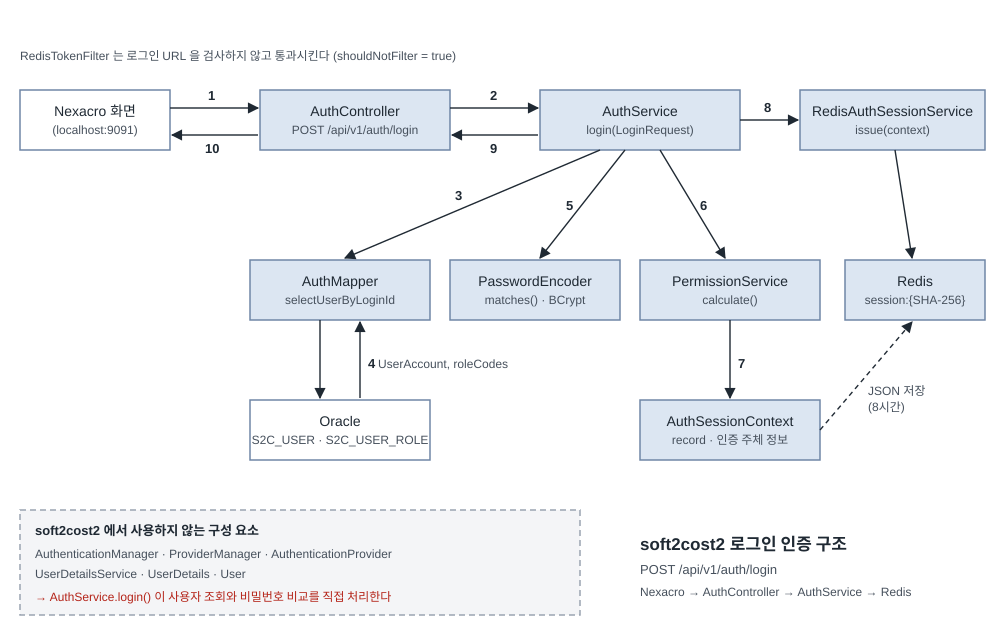
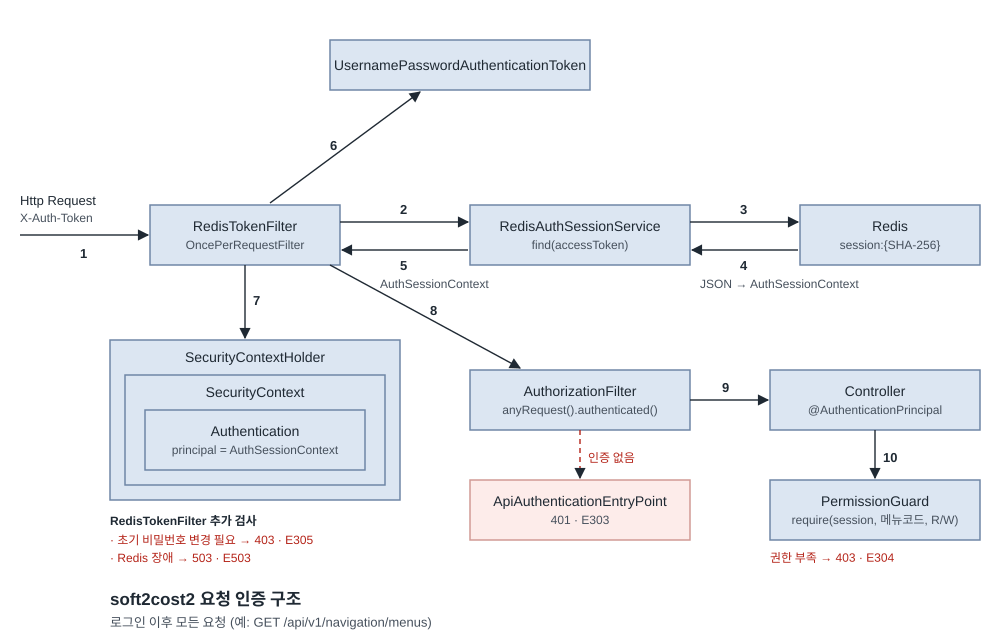

# Spring Security 인증 구조 — soft2cost2 적용판

> 원본: https://wwwaloha.oopy.io/e9695a98-0bf6-469d-b826-6d2695fc13b8 (Spring Security → "스프링 시큐리티 (Spring Security)" 절)
> 대상: `rwkang321/soft2cost2` (커밋 `ff1aba1`)
> 관련 문서: `soft2cost2_20260928_1806.md` (사용자 정의 인증 — soft2cost2 적용판)
> 원본의 인증 구조 그림(Spring Security Authentication Architecture, 번호 1~10)과 같은 형식으로 soft2cost2의 실제 구조를 다시 그렸습니다. 구성 요소 설명과 요청 흐름도 원본과 같은 순서로 정리했습니다.
> 이 문서는 분석 문서입니다. 소스 수정은 없습니다.

---

> ⚠️ **원본은 Spring Security 6 이상을 기준으로 설명합니다. soft2cost2는 아래 기준입니다.**

- **Spring Security 7 계열 (Spring Boot 4.0.8에 포함)**
- **Spring Boot 4.0.8 / Java 17**
- **Oracle**
- **MyBatis**
- **Redis (로그인 세션 저장소)**
- **Nexacro (화면, 포트 9091) ↔ Spring REST API (포트 8081)**

**✅ Spring Security 5.7 이상 : `SecurityFilterChain` 빈 등록 방식** → soft2cost2가 사용하는 방식 (`common/security/SecurityConfig.java`)

✅ Spring Security 5.7 미만 : `WebSecurityConfigurerAdapter` 상속 구현 방식 → soft2cost2에서 사용하지 않음

---

## 스프링 시큐리티 (Spring Security)

스프링 시큐리티는 **스프링 기반 애플리케이션의 인증과 권한 부여를 담당하는 프레임워크**입니다.

원본 그림은 **폼 로그인 한 번의 요청 안에서** 필터 → 인증 관리자 → 인증 제공자 → 사용자 정보 서비스 순서로 인증이 끝나는 구조입니다.
soft2cost2는 이 과정을 **두 단계로 나눕니다.**

| 구분 | 언제 | 무엇을 하는가 | 그림 |
|---|---|---|---|
| ① 로그인 | `POST /api/v1/auth/login` 한 번 | 아이디·비밀번호 확인, 권한 계산, Redis 세션 저장, 토큰 발급 | 그림 1 |
| ② 로그인 이후 요청 | 그 뒤의 모든 API 요청 | `X-Auth-Token` 헤더의 토큰으로 Redis 세션을 찾아 인증 객체 생성 | 그림 2 |

### 그림 1. soft2cost2 로그인 인증 구조 (`POST /api/v1/auth/login`)

1. **Nexacro → AuthController**: Nexacro 로그인 화면이 `{"loginId", "password"}` JSON을 보냅니다. `RedisTokenFilter`는 로그인 URL을 검사하지 않고 통과시키고(`shouldNotFilter`), `SecurityConfig`에서 `permitAll()`로 열려 있습니다.
2. **AuthController → AuthService**: `@Valid`로 입력을 검증한 뒤 `authService.login(request)`를 호출합니다.
3. **AuthService → AuthMapper**: `selectUserByLoginId(loginId)`로 사용자를 조회합니다.
4. **Oracle → AuthMapper → AuthService**: `S2C_USER` 한 행이 `UserAccount`로 돌아옵니다. 역할 코드는 `selectRoleCodes(userId)`로 `S2C_USER_ROLE` + `S2C_ROLE`에서 따로 읽습니다.
5. **AuthService → PasswordEncoder**: `passwordEncoder.matches(입력 비밀번호, PASSWORD_HASH)`로 BCrypt 비교를 합니다. 사용 여부(`USE_YN`), 인증 유형(`AUTH_TYPE = LOCAL`), 상태(`ACTIVE` / `LOCKED`), 연속 실패 잠금도 여기서 검사합니다.
6. **AuthService → PermissionService**: 전체 메뉴, 역할별 메뉴 권한, 사용자 개별 예외 권한을 합쳐 최종 `List<MenuPermission>`을 계산합니다.
7. **AuthSessionContext 생성**: 사용자 정보, 소속(회사·사업장·부서), 역할 코드, 메뉴 권한, 초기 비밀번호 변경 필요 여부를 하나의 record로 묶습니다.
8. **AuthService → RedisAuthSessionService → Redis**: 난수 토큰을 만들고, 토큰의 SHA-256 해시를 키로 `AuthSessionContext` JSON을 Redis에 저장합니다(기본 8시간).
9. **AuthService → AuthController**: 원본 토큰(`accessToken`)을 담은 `LoginResponse`를 돌려줍니다.
10. **AuthController → Nexacro**: Nexacro가 `accessToken`을 보관합니다. 이후 모든 요청에 `X-Auth-Token` 헤더로 보냅니다.

> ✅ 로그인 요청에서는 `SecurityContextHolder`에 아무것도 저장하지 않습니다. 인증 객체는 **다음 요청부터** `RedisTokenFilter`가 만듭니다 (그림 2).

### 그림 2. soft2cost2 요청 인증 구조 (로그인 이후 모든 요청)

1. **Http Request → RedisTokenFilter**: 요청 헤더 `X-Auth-Token`에서 토큰을 꺼냅니다. (원본의 `AuthenticationFilter` 위치)
2. **RedisTokenFilter → RedisAuthSessionService**: `find(accessToken)`을 호출합니다. (원본의 `AuthenticationManager` 위치)
3. **RedisAuthSessionService → Redis**: 토큰을 SHA-256으로 해시해 `soft2cost2:auth:v1:session:{해시}` 키를 조회합니다. (원본의 `AuthenticationProvider` → `UserDetailsService` 위치)
4. **Redis → RedisAuthSessionService**: JSON을 `AuthSessionContext`로 복원하고, `expiresAt`이 지났으면 세션을 지우고 빈 값을 돌려줍니다.
5. **RedisAuthSessionService → RedisTokenFilter**: `AuthSessionContext`를 돌려줍니다. 이때 `passwordChangeRequired = true`이면 비밀번호 변경·로그아웃 외 요청을 403(E305)으로 막고, Redis 장애이면 503(E503)으로 응답합니다.
6. **UsernamePasswordAuthenticationToken 생성**: `new UsernamePasswordAuthenticationToken(context, null, authorities)` — 인증 주체는 `AuthSessionContext`, 권한은 역할 코드 앞에 `ROLE_`을 붙인 값입니다 (`SYSTEM_ADMIN` → `ROLE_SYSTEM_ADMIN`).
7. **SecurityContextHolder에 저장**: `SecurityContextHolder.getContext().setAuthentication(authentication)`. 이 순간부터 이 요청은 인증된 요청입니다.
8. **AuthorizationFilter**: `anyRequest().authenticated()` 규칙을 검사합니다. 토큰이 없거나 세션이 없어 7번이 실행되지 않았다면 `ApiAuthenticationEntryPoint`가 401(E303)로 응답합니다.
9. **Controller**: `@AuthenticationPrincipal AuthSessionContext session`으로 사용자 정보를 받습니다. Oracle을 다시 조회하지 않습니다.
10. **PermissionGuard**: 메뉴별 권한이 필요한 API는 `permissionGuard.require(session, 메뉴코드, "R" 또는 "W")`로 검사합니다. 권한이 부족하면 403(E304)입니다. (예: `MenuAdminController` — 메뉴코드 `SYS_MENU_MGMT`)

---

### 구성 요소 (원본 목록과 같은 순서)

1. **AuthenticationFilter**:
   - **[원본]** 필터 체인에서 인증을 처리합니다. 사용자가 사용자 이름과 비밀번호를 제출하면 이 필터가 인증을 시작합니다.
   - **[soft2cost2]** 아이디·비밀번호 인증은 필터가 아니라 `AuthController` → `AuthService.login()`이 처리합니다. 필터 역할은 `RedisTokenFilter`(`OncePerRequestFilter` 상속)가 맡고, 비밀번호가 아니라 **토큰**으로 인증합니다. `UsernamePasswordAuthenticationFilter` 앞에 등록됩니다.
2. **UsernamePasswordAuthenticationToken**:
   - **[원본]** 사용자 이름과 비밀번호를 담는 `Authentication` 구현체입니다. 주로 폼 로그인에서 사용됩니다.
   - **[soft2cost2]** 같은 클래스를 쓰지만 비밀번호는 담지 않습니다. `RedisTokenFilter`가 `(AuthSessionContext, null, ROLE_ 권한 목록)`으로 **이미 인증된 상태**의 객체를 만듭니다.
3. **AuthenticationManager**:
   - **[원본]** `Authentication` 객체를 받아 사용자를 인증하는 인터페이스입니다.
   - **[soft2cost2]** 사용하지 않습니다. 로그인 때는 `AuthService.login()`, 이후 요청 때는 `RedisAuthSessionService.find()`가 이 역할을 대신합니다.
4. **ProviderManager**:
   - **[원본]** 기본 `AuthenticationManager` 구현체로, 여러 `AuthenticationProvider`를 관리합니다.
   - **[soft2cost2]** 사용하지 않습니다. 인증 방법이 하나(로컬 비밀번호 + Redis 토큰)이므로 순회할 제공자가 없습니다. `AUTH_TYPE`이 `LOCAL`이 아닌 계정(예: SSO, LDAP)은 로그인 단계에서 거부됩니다.
5. **AuthenticationProvider**:
   - **[원본]** 실제 인증을 수행합니다. 대표적으로 `DaoAuthenticationProvider`가 사용자 조회와 비밀번호 비교를 합니다.
   - **[soft2cost2]** 사용하지 않습니다. `DaoAuthenticationProvider`가 하던 "사용자 조회 + 비밀번호 비교"를 `AuthService.login()`이 `AuthMapper` + `PasswordEncoder.matches()`로 직접 합니다. 여기에 원본에 없는 연속 실패 잠금(`LoginAttemptService`)이 더해져 있습니다.
6. **UserDetailsService**:
   - **[원본]** 사용자 이름으로 사용자 정보를 불러오는 인터페이스입니다.
   - **[soft2cost2]** 구현하지 않습니다. 사용자 정보는 `AuthMapper.selectUserByLoginId()`로 불러옵니다.
7. **UserDetails**:
   - **[원본]** 사용자 이름, 비밀번호, 권한을 담는 인터페이스입니다.
   - **[soft2cost2]** 구현하지 않습니다. DB 정보는 `UserAccount` record에, 인증 이후 정보는 `AuthSessionContext` record에 담습니다.
8. **User**:
   - **[원본]** Spring Security가 기본 제공하는 `UserDetails` 구현 클래스입니다.
   - **[soft2cost2]** 사용하지 않습니다. `getPrincipal()`이 돌려주는 객체는 `AuthSessionContext`입니다.
9. **SecurityContextHolder**:
   - **[원본]** 현재 사용자의 `SecurityContext`를 관리합니다.
   - **[soft2cost2]** 같습니다. `RedisTokenFilter`가 요청마다 채우고, Redis 장애 때는 `clearContext()`로 비웁니다. 세션 정책이 `STATELESS`이므로 요청이 끝나면 남지 않습니다.
10. **SecurityContext**:
    - **[원본]** 현재 사용자의 보안 정보를 담는 그릇입니다.
    - **[soft2cost2]** 같습니다. 다만 요청 사이에 서버 HTTP 세션으로 이어지지 않고, 매 요청마다 Redis에서 다시 만들어집니다.
11. **Authentication 클래스**:
    - **[원본]** 사용자의 인증 정보와 권한 정보를 담습니다.
    - **[soft2cost2]** 실제 객체는 `UsernamePasswordAuthenticationToken`입니다. `getPrincipal()` = `AuthSessionContext`, `getAuthorities()` = `ROLE_` + 역할 코드. `PermissionGuard.has(authentication, ...)`가 이 객체에서 메뉴 권한을 꺼내 검사합니다.

#### 구성 요소 대응표

| 번호 | 원본 구성 요소 | soft2cost2 | 사용 여부 |
|---|---|---|---|
| 1 | `AuthenticationFilter` | `RedisTokenFilter` (요청 인증) / `AuthController` (로그인) | 대체 |
| 2 | `UsernamePasswordAuthenticationToken` | 같은 클래스 — `RedisTokenFilter`가 생성 | 사용 |
| 3 | `AuthenticationManager` | `AuthService.login()` / `RedisAuthSessionService.find()` | 미사용 |
| 4 | `ProviderManager` | 없음 | 미사용 |
| 5 | `AuthenticationProvider` (`DaoAuthenticationProvider`) | `AuthService.login()` + `PasswordEncoder` + `LoginAttemptService` | 미사용 |
| 6 | `UserDetailsService` | `AuthMapper.selectUserByLoginId()` | 미사용 |
| 7 | `UserDetails` | `UserAccount` / `AuthSessionContext` | 미사용 |
| 8 | `User` | `AuthSessionContext` | 미사용 |
| 9 | `SecurityContextHolder` | 같음 — `RedisTokenFilter`가 채움 | 사용 |
| 10 | `SecurityContext` | 같음 — 요청마다 새로 만듦 (`STATELESS`) | 사용 |
| 11 | `Authentication` | `UsernamePasswordAuthenticationToken` (principal = `AuthSessionContext`) | 사용 |
| — | (원본에 없음) | `RedisAuthSessionService`, Redis, `PermissionService`, `PermissionGuard`, `ApiAuthenticationEntryPoint`, `ApiAccessDeniedHandler` | 추가 |

### 스프링 시큐리티 요청 흐름

원본의 12단계를 같은 순서로 두고, soft2cost2에서 각 단계가 어떻게 되는지 적었습니다.

| 단계 | 원본 | soft2cost2 |
|---|---|---|
| 1 | 사용자가 로그인을 시도합니다. | Nexacro 로그인 화면에서 로그인을 시도합니다. |
| 2 | 로그인 폼의 사용자 이름·비밀번호가 `AuthenticationFilter`로 전달됩니다. | `POST /api/v1/auth/login` JSON이 `AuthController`로 전달됩니다. `RedisTokenFilter`는 이 URL을 건너뜁니다. |
| 3 | `AuthenticationFilter`가 `UsernamePasswordAuthenticationToken`을 만듭니다. | 토큰 객체를 만들지 않습니다. `LoginRequest` record(`loginId`, `password`)를 `@Valid`로 검증합니다. |
| 4 | 토큰이 `AuthenticationManager`(`ProviderManager`)로 전달됩니다. | `AuthService.login(request)`를 직접 호출합니다. |
| 5 | `ProviderManager`가 `AuthenticationProvider`들을 순회합니다. | 순회 없음. 로컬 비밀번호 방식 하나만 사용합니다. |
| 6 | `DaoAuthenticationProvider`가 사용자를 조회하고 비밀번호를 비교해 `Authentication`을 만듭니다. | `AuthMapper.selectUserByLoginId()` → `PasswordEncoder.matches()` → 상태·잠금 검사 → 역할·메뉴 권한 계산 → `AuthSessionContext` 생성 |
| 7 | `AuthenticationManager`가 `Authentication`을 필터로 돌려줍니다. | `RedisAuthSessionService.issue()`가 Redis에 저장하고 `accessToken`을 돌려줍니다. `LoginResponse`로 Nexacro에 응답합니다. |
| 8 | 필터가 `Authentication`을 `SecurityContextHolder`에 저장합니다. | **다음 요청부터**: `RedisTokenFilter`가 `X-Auth-Token` → Redis 조회 → `UsernamePasswordAuthenticationToken` 생성 → `SecurityContextHolder`에 저장합니다. |
| 9 | 인증 후 권한 부여(Authorization) 단계로 이동합니다. | `AuthorizationFilter`가 `anyRequest().authenticated()`를 검사합니다. 인증이 없으면 401(E303). |
| 10 | `@PreAuthorize`, `@PostAuthorize`, `@Secured`로 메서드 권한을 확인합니다. | `@EnableMethodSecurity`는 켜져 있지만 이 어노테이션들은 쓰지 않습니다. Controller와 Service에서 `permissionGuard.require(session, 메뉴코드, "R"/"W")`를 직접 호출합니다. |
| 11 | 허용되면 요청이 성공하고 응답이 반환됩니다. | 허용되면 Controller가 JSON을 응답합니다 (예: `GET /api/v1/navigation/menus` → `List<MenuPermission>`). |
| 12 | 권한이 없으면 접근이 거부되고 오류 메시지나 리디렉션을 받습니다. | 리디렉션 없이 JSON 오류로 응답합니다: 401(E303) 인증 없음, 403(E304) 권한 부족, 403(E305) 초기 비밀번호 변경 필요, 503(E503) Redis 장애. |
